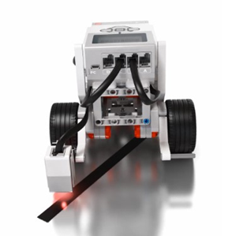
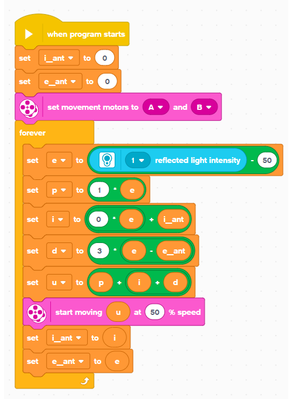

# Line follower robot LEGO

A repository of control algorithms for LEGO EV3 line-follower robots using different control strategies.

Digital proportional-integral-derivative (PID) and their variations are implemented for both the original EV3 software and MicroPython. Moreover, the repository is intended as a practical reference for learning, testing, and comparing different control approaches.

The following programs are available:
- [Line follower PID](./line_follower_pid)
- [Line follower PID MicroPython](./line_follower_pid_micropython)

## LEGO robot

A typical LEGO EV3 line-follower robot is shown below.

    

A basic implementation of a LEGO EV3 line-follower program is shown below. More advanced implementations are available in this repository, while others remain private.

    

